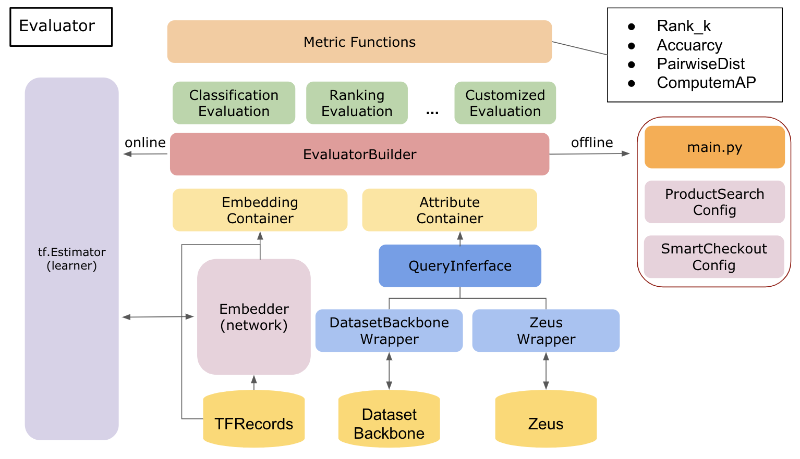

# Metric Learning Evaluator

## System Architecture Overview



## Installation

```
python setup.py install
```

## Usage
How to use evaluator?
- Online mode
- Off-line mode

### Description
- EvaluationBuilder
- EmbeddingContainer
- AttributeContainer
- QueryIterface
- Metrics

## Configuration

Usage:
     The configuration is used to change hyper-parameters but not change metric items.

There are 5 required items should be defined in the configuration.
- database
- evaluation
- container_size
- embedding_size
- logit_size


### `evaluation`

Define type of metrics and attribute in each evaluations, like:

```python

FacenetEvaluation:
    distance_threshold:
        - 0.5
        - 1.0
```

The format of `per_eval_config` is the following:
```python
EvaluationName:
    metric:
        metric_type_1:
            - parameter_1
            - parameter_2
        metric_type_2: parameter
    attribute:
        - attribute_0
        - attribute_1
    option:
        path: <string>
        ratio: <float>
```


## Evaluated Results

```python

eval_results = {
    # e.g. classification
    'evaluation_name':
    {
        # level of attributes
        'attribute_type':
        {
            # e.g. top_k accuracy
            # NOTE: maybe this layer would be cancelled .
            'metric_type':
            {
                # e.g. IoU, top k
                'threshold': value # or list of values?
            },
        }
    }
}

```

### Example

### Report Writer

## Customized Evaluation

Steps:

- Standard Fields
  - Evaluation Standard Fields
  - Metric Standard Fiedls
  - Attribute Standard Fields
- Registration


## Cooperative Repo
- tf-metric-learning
