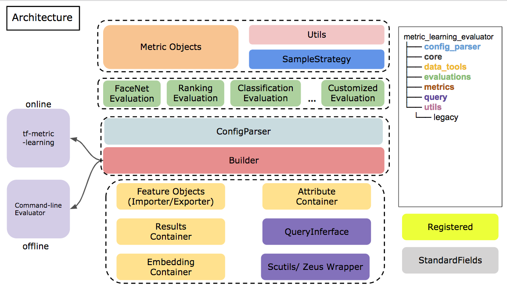

# Metric Learning Evaluator

## System Architecture Overview

[Slide: Introduction to metric learning evaluator](https://docs.google.com/presentation/d/1kSiPbLofAJ1W46IV0TKONhhGPCtsuis3RWezKKR88x8/edit?usp=sharing)




### Modules & Components
- `application`: Command-line applications
- `analysis`: Analysis tools
- `core`: Define standard fields
- config_parser
- `evaluations`: Customized applications for measuring model performance
- `metrics`: Computational objects used in evaluations
- `index`: Provide fast algorithm for query features and distance functions
- `query`: Attribute database general interface
- `tools`: Scripts for some utilities
  - NOTE: should we promote to analysis tool?
- `data_tools`: General data containers including embedding, attribute and result containers
- `utils`: Contains sampler, switcher
- `inference`: Tools for extracting features, detect boxes and pre-labeling, which can be used calling `ml-inference`.


### Roadmap and TODOs

#### Roadmap
- inference
- analysis
- front-end gui

#### TODO
- Save out data reside in container.
  - Consider concatenating each containers
- Manifold
  - locality
  - input robustness
  - margin search
  - find reasonable center
- ImageContainer?
  - ContainerBaseObject?
  - <T>Container <-> <T>Object

- Change cmdline name, design operation logic

## Installation
```
python setup.py install
```
Two command-line tools will be installed: `ml-evaluation` and `ml-inference`.

### Intallation of `hnswlib`

Source: [hnswlib](https://github.com/nmslib/hnswlib)
Binding installation
```
git clone https://github.com/nmslib/hnswlib
apt-get install -y python-setuptools python-pip
pip3 install pybind11 numpy setuptools
cd hnswlib/python_bindings
python3 setup.py install
```

## Usage
How to use evaluator?
- Online mode

On-line evaluation is embedded in `tf-metric-learning` repo, for more detailed please refer to `tf-metric-learning/builders/evaluator_builder.py`.

Estimator will execute evaluations and provide info like
```
INFO:tensorflow:Saving dict for global step 1500: global_step = 1500, loss = 7.452976, rank-all_classes-mAP = 0.495, rank-all_classes-top_k_hit_accuracy-@k=1 = 0.49666667, rank-all_classes-top_k_hit_accuracy-@k=5 = 0.49666667
```

- Off-line mode

NOTE: There will be a new usage logic and operations  .

One can use command-line tool called `ml-eval` to execute evaluations.

```
usage: Command-line Metric Learning Evaluation Tool [-h] [--config CONFIG]
                                                    [--data_dir DATA_DIR]
                                                    [--data_type DATA_TYPE]
                                                    [--out_dir OUT_DIR]
                                                    [--embedding_size EMBEDDING_SIZE]
                                                    [--logit_size LOGIT_SIZE]

optional arguments:
  -h, --help            show this help message and exit
  --config CONFIG, -c CONFIG
                        Path to the evaluation configuration with yaml format.
  --data_dir DATA_DIR, -dd DATA_DIR
                        Path to the source dataset, tfrecord |
                        dataset_backbone | folder
  --data_type DATA_TYPE, -dt DATA_TYPE
                        Type of the input dataset.
  --out_dir OUT_DIR, -od OUT_DIR
                        Path to the output dir for saving report.
  --embedding_size EMBEDDING_SIZE, -es EMBEDDING_SIZE
                        Dimension of the given embeddings.
  --logit_size LOGIT_SIZE, -ls LOGIT_SIZE
                        Size of the logit used in container.
```

for example

```
ml_evaluator -c eval_config.yml -dd extracted_embeddings_facenet-centerloss-batch512
```

NOTE: Off-line mode not fully supported now.

## ISSUES
- Pushed embeddings are more than container size.
- Configuration and metric names are not standard
- attribute container should be the only way that external information is added
  - we should parse grouping_rules.json in parser
- number of sampled instances


## Cooperative Repo
- tf-metric-learning
