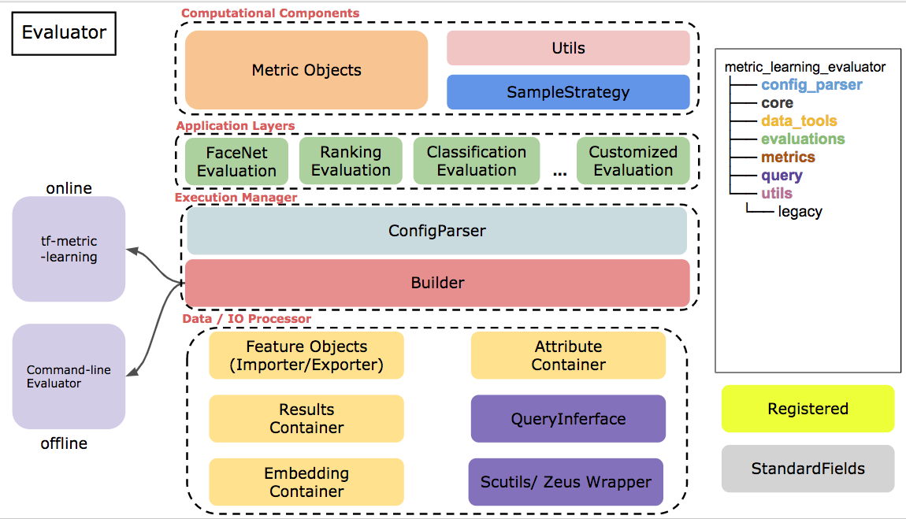

# Metric Learning Evaluator

## Introduction

The repo provides the metric learning evaluation tool which support online (training time) evaluation and offline performance & report generation. Several features the evaluator provides
1. Modularization of each performance measures
2. Efficient and reusable data container
3. Several command line tools for smooth data manipulation


## Installation

Install **metric_learning_evaluator**

```
python setup.py install
```
The command-line tool will be installed as `ml-evaluation`

### Dependencies and `hnswlib`
Run the script to install
```bash
  sh install_hnsw.sh
```

### Quick Start
```bash
 ml-evaluation -c configs/eval_container_example.yaml -dd feature-examples/container_example/
```

## Applications
Two major application (command-line tools) are provided
- Evaluation app
  - `ml-evaluation`


Source: [hnswlib](https://github.com/nmslib/hnswlib)
Binding installation
```
sh install_hnsw.sh
```

## System Overview
```bash
metric_learning_evaluator/
├── analysis
├── application
├── config_parser
├── core
├── data_tools
├── evaluations
├── index
├── metrics
├── query
├── tools
└── utils
```

[Slide: Introduction to metric learning evaluator](https://docs.google.com/presentation/d/1vbioISjJxla8kRMye2WErpovYlfeADtqaO0E9KR6Aw4/edit?usp=sharing)




### Modules & Components
- `application`: Command-line applications
- `analysis`: Analysis tools
- `core`: Define standard fields
- `config_parser`
- `evaluations`: Customized applications for measuring model performance
- `metrics`: Computational objects used in evaluations
- `index`: Provide fast algorithm for query features and distance functions
- `query`: Attribute database general interface
- `tools`: Scripts for some utilities
- `data_tools`: General data containers including embedding, attribute and result containers
- `utils`: Contains sampler, switcher
